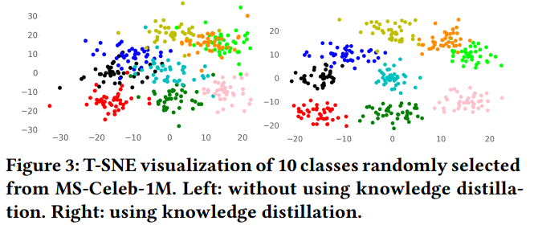

# 참조 문헌

상태: 진행 중
엔지니어: 익명
유형: 에픽 ⛰️
작성일시: 2021년 12월 1일 오후 3:31

### **68-points detector**

Adrian Bulat and Georgios Tzimiropoulos. How far are we
from solving the 2d & 3d face alignment problem? (and a
dataset of 230,000 3d facial landmarks). In International
Conference on Computer Vision, 2017.

### MTCNN

Kaipeng Zhang, Zhanpeng Zhang, Zhifeng Li, and Yu Qiao. 2016. Joint face

detection and alignment using multitask cascaded convolutional networks. IEEE

Signal Processing Letters 23, 10 (2016), 1499–1503.

### 전통적인 메소드 두개와 다르게 놀라운 성과를 보이고 있음.

showing incredible superiority to conventional face recognition methods, such as EigenFace [19, 53, 54] and subspace-based methods [3].

[19] Sheifali Gupta, OP Sahoo, Ajay Goel, and Rupesh Gupta. 2010. A new optimized
approach to face recognition using eigenfaces. Global Journal of Computer
Science and Technology (2010).

[53] Mohamed Rizon, Hashim Muhammad Firdaus, Saad Puteh, Yaacob Sazali, Mamat
Mohd Rozailan, Ali Yeon, Md Shakaff, Saad Abdul Rahman, Desa Hazri, and
M Karthigayan. 2006. Face recognition using eigenfaces and neural networks.
(2006).

[54] Hossein Sahoolizadeh and Youness Aliyari Ghassabeh. 2008. Face recognition using eigen-faces, fisher-faces and neural networks. In 2008 7th IEEE International
Conference on Cybernetic Intelligent Systems. 1–6.

[3] P Aishwarya and Karnan Marcus. 2010. Face recognition using multiple eigenface subspaces. Journal of Engineering and Technology Research 2, 8 (2010),
139–143.

### 깊은 얼굴 인식 접근 방식은 인간의 인식을 능가하는 것으로 보고되었지만[59, 60], 재현성 문제가 우려되었습니다. 즉, 논문에서 발표된 세부 사항에서 알고리즘과 모델을 다시 구현했을 때 동일한 성능을 달성하기 어려울 수 있습니다.

[59] Yi Sun, Ding Liang, Xiaogang Wang, and Xiaoou Tang. 2015. Deepid3: Face
recognition with very deep neural networks. arXiv preprint arXiv:1502.00873
(2015).
[60] Yi Sun, Xiaogang Wang, and Xiaoou Tang. 2014. Deep learning face representation from predicting 10,000 classes. In CVPR. 1891–1898

### face recognition system consists of face detection, facial landmark localization, face alignment, feature extraction and matching [31, 73].

[31] Zhao Jian. 2018. Deep learning for human-centric image analysis. (2018).
[73] Mei Wang and Weihong Deng. 2018. Deep face recognition: A survey. arXiv
preprint arXiv:1804.06655 (2018).

### Pipeline

split the face recognition pipeline into four modules: face detection & alignment, data processing, feature extraction and the loss head.

## Bag of Tricks

### Learning rate adjustment

- 학습 시작 단계에서 모든 파라미터는 일반적으로 랜덤한 값
    - 최적으로부터 멀어진 값임.
    - 큰 학습률은 일반적으로 unstable한 결과
- Warmup[15]
    - 학습 시작 단계에서 작은 학습률 사용
    - 훈련 과정이 안정되면 초기 학습률로 전환
    - warmup 후에, learning rate decay 사용
    - [15] Akhilesh Gotmare, Nitish Shirish Keskar, Caiming Xiong, and Richard Socher. 2018. A closer look at deep learning heuristics: Learning rate restarts, warmup and distillation. arXiv preprint arXiv:1810.13243 (2018).
- Cosine annealing strategy[43]
    - 단순화된 버전은 코사인 함수를 따라 학습률을 초기 값에서 0으로 줄이는 것
    - cosine decay는 학습 속도를 처음에는 천천히 감소하다가 중간에 거의 선형으로 감소하다가 마지막에 다시 느려짐.
      
        [43] Ilya Loshchilov and Frank Hutter. 2016. Sgdr: Stochastic gradient descent with warm restarts. arXiv preprint arXiv:1608.03983 (2016).
    
- Cosine strategy가 중간 훈련 단계에서 step decay를 사용하는 것보다 훨씬 더 부드럽고 학습 속도가 더 크므로 수렴이 빨라져 잠재적으로 최종 성능이 향상됨.

### Label Smoothing

- Inception-v2[62] 에서 처음 제안됨.
- 레이블을 one-hot vector에서 일부 분포로 변경
- output distribution center is close to the theoretical value and has fewer extreme values.
- [62] Christian Szegedy, Vincent Vanhoucke, Sergey Ioffe, Jon Shlens, and Zbigniew Wojna. 2016. Rethinking the inception architecture for computer vision. In CVPR. 2818–2826.

### Model tweak

- 네트워크 일부 구조 변경
- 구현자의 경험과 지식에 의존
- 일반적으로 계산 복잡도는 거의 변경되지 않고, 모델 정확도에는 무시하지 못할 정도의 영향

### Knowledge distillation

- 거의 모든 모델은 잡음이 섞인 identity label을 겪음.
- label noise를 감소하고 인식 정확도 향상에 목적을 둠.
- 데이터 세트가 상대적으로 크고 레이블 노이즈를 줄이고 더 나은 얼굴 표현을 학습하기 위해 self-training과 knowledge distillation을 적용할 수 있음[23, 33].
- 얼굴 분류가 더욱 쉬워짐.
- [23] Geoffrey Hinton, Oriol Vinyals, and Jeff Dean. 2015. Distilling the knowledge in a neural network. arXiv preprint arXiv:1503.02531 (2015).
- [33] Kyungyul Kim, ByeongMoon Ji, Doyoung Yoon, and Sangheum Hwang. 2020. Self-knowledge distillation: A simple way for better generalization. arXiv preprint arXiv:2006.12000 (2020).

